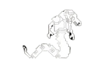

# Mission In The Moon  🌕
**Midterm Project Group 2**

# โครงงาน PLATFORMER 2D 🌕
**CP352203 - Computer Game Development**

# ผู้จัดทำ 🚀
- 673380025-8 นายกรกฏ พรมทอง CP-CS (วิทยาลัยการคอมพิวเตอร์)
- 673380059-1 นายวัชรวิศว์ น้อยเมล์ CP-CS (วิทยาลัยการคอมพิวเตอร์)
- 673380263-2 นายจิณณวัตร โพธิ์ศรีทอง CP-CS (วิทยาลัยการคอมพิวเตอร์)
- 673380295-9 นายสรวิชญ์ ทะมานันท์ CP-CS (วิทยาลัยการคอมพิวเตอร์)

# ชื่อเกม 🌕
**Mission In The Moon (ภารกิจในดวงจันทร์)**

# Theme 🌕
**Platformer ,2D ,8 Bit**

# Story 🌕
นีล อาร์มสตอง เขาได้รับภารกิจจากนาซ่าให้ออกสำรวจดวงจันทร์ ภารกิจของเขาคือ การตามเก็บทองดวงจันทร์ให้ได้มากที่สุด เพื่อนำทองดวงจันทร์กลับไปยังโลก เพื่อให้นาซ่าวิจัย เพราะทองบนโลกกำลังจะหมด และนาซ่าพบว่าดวงจันทร์มีทองแต่มีลักษณต่างออกไป นาซ่าจึงอยากรู้ว่าทองดวงจันทร์สามารถทดแทนทองบนโลกได้ไหม ดังนั้นเขาจึงเริ่มออกเดินทางบนดวงจันทร์เพื่อตามหาทอง เขาพบทองแต่แล้วเขาก็พบว่ามีเอเลี่ยนมากมายคอยเฝ้าทองอยู่ เขาจึงต้องต่อสู้กับพวกมันและฝ่าฟันกับดักเพื่อแย่งชิงทองและกลับไปยังโลกให้ได้

# Character 👽

- Neil Armstrong
  - ตัวเอกของเรื่อง ที่ได้รับภารกิจจากนาซ่า
  - เป้าหมายของเขาคือเก็บทองดวงจันทร์ให้ได้เยอะที่สุด
  - สามารถใช้ปืนเป็นอาวุธ
- CODE-NAME “A137” (Enemy)
  - ผู้ที่คอยขัดขวางและโจมตีผู้เล่น
  - ใช้ปืนเป็นอาวุธ
- CODE-NAME “SNAKE149” (Enemy)
  - ผู้ที่คอยเฝ้ายามตามตำแหน่งต่างๆ
  - ใช้ลำตัวทำความเสียหาย

# รูปแบบการเล่น และ กติกา 🚀
- **การควบคุมตัวละคร**
- A : เดินไปทางซ้าย
- D : เดินไปทางขวา
- Space Bar : กระโดด
- J:ยิงปืน
- **รูปแบบการเล่น**
- เกม 2D platformmer:เป็นเกมแนวplatform ผู้เล่นต้องต่อสู้เพื่อด่าน และมี FOV จำกัดการมองเห็นของผู้เล่น
- กับดัก:ในด่านจะมีกับดักคอยขัดขวางผู้เล่น
- ศัตรู:ในด่านจะมีศัตรูออกมาขัดขวางผู้เล่น
- การโจมตีของศัตรู:โดยมีศัตรูอยู่มีอยู่ 2 ประเภท 
  1. ผู้ที่อาวุธระยะประชิด:เมื่อเดินถึงตัวผู้เล่นจะทำให้พลังชีวิตลดลง
  2. ผู้ที่ใช้อาวุธระยะไกล:เมื่อยิงโดนผู้เล่นจะทำให้พลังชีวิตลดลง
- ภารกิจในด่าน:ผู้เล่นต้องกำจัดศัตรูในด่านให้หมดและเก็บทองให้ได้มากที่สุด
- ระบบไอเทม: ผู้เล่นต้องเก็บ ทองตามด่านต่างๆ
**กติกา**
ผู้เล่นต้องเก็บทอง ระหว่างทาง
ผู้เล่นต้องระวังสิ่งกีดขวาง เช่น กับดัก
หากโดนโจมตีหรือโดนกับดัก พลังชีวิตจะลดลง  
เมื่อผู้เล่นพลังชีวิตหมดจะเกมโอเวอร์และเริ่มต้นใหม่
เมื่อผู้เล่นสามารถกลับถึงยานบินอวกาศได้ จะถือว่าชนะ

# แนวคิดการออกแบบ 👽
- **งานภาพ**
-ออกแบบฉากให้เป็นธีมอวกาศ ไซไฟ
-งานภาพเป็น pixel art ให้ความรู้สึกคลาสสิก คิดถึงอดีต
- สีภาพเป็นแบบขาวดำเหมือนเกมสมัยก่อน
- **เสียง**
-เสียงเพลงแนว 8 bit 
-เพลงประกอบ: เป็นเสียง 8 bit เหมือนเสียงเกม arcade สมัยก่อน 
-เสียงประกอบ: เสียงยิงปืน
- **แรงบันดาลใจ**
-มาจากเกม Mario ,Space invader

# กลุ่มเป้าหมาย (ผู้เล่น) 🛸👽
- เด็กที่ชอบเล่นเกมแนว platform หรือชื่นชอบเกมที่เกี่ยวกับธีมอวกาศ
- ผู้ใหญ่ที่คิดเกมแบบสมัยอดีตที่เป็นภาพชาวดำ เสียงประกอบที่เป็นแบบสมัยก่อน

# AGE Analysis 🌕
- **อารมณ์ของเกม:**
- ความเศร้า-เสียใจ จากการตายในเกม
- ความโกรธ จากการโดน damage จากสิ่งเร้าในเกมต่างๆ
- ความตื่นเต้น การเอาตัวรอดจากศัตรูและการได้กำจัดศัตรูและสามารถเก็บทองได้ทั้งหมด
- ความกลัว การโดนศัตรูหรือกับกับดักโจมดี
- ความภูมิใจ การกำจัดศัตรูได้ทั้งหมดในด่านโดยไม่เสียเลือดและเก็บทองได้ทั้งหมด
- ความสุข การที่สามารถจัดการศัตรูลงได้และสามารถชนะเกมได้
- **สิ่งที่ใช้กระตุ้นสัญชาติญาณ**
- การเอาชีวิตรอด ต้องเอาชีวิตรอดจากการโจมตีของศัตรูและกับดัก
- อยากสวมบทบาท (เป็นตัวละครในเกม) สวมบทบาทเป็นนักบินอวกาศที่ออกมาทำภารกิจให้นาซ่า
- สะสมสิ่งของ ต้องเก็บทอง
- ความโลภ การเก็บทองในพื้นที่ที่มีศัตรูคอยโจมตีผู้เล่นอยู่เยอะ
- การปกป้อง ปกป้องชีวิตของตัวเองในเกมให้ถึงที่สุด
- การสื่อสาร ไม่มีระบบสื่อสาร
- ชอบสีสัน ออกแบบสีให้เป็นขาวดำ
- สำรวจ มีด่านที่หลากหลาย 
- ก้าวร้าว มีอาวุธปืนพก เพื่อใช้ต่อสู้กับศัตรู
- ความแค้น แค้นจากการถูกโจมตี
- แข่งขัน การแข่งเก็บเหรียญให้ได้มากที่สุด

# ประโยชน์ของเกม
- ความท้าทาย ฝึกความอดทด ฝึกทักษะ
